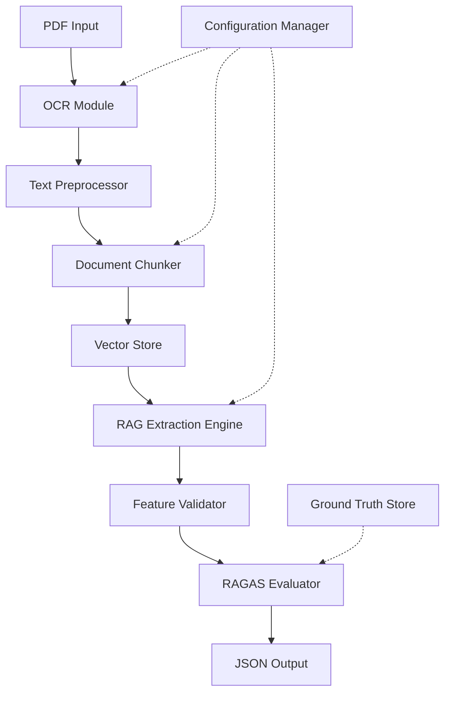

# Design Document: Property Data Extraction System

## Overview

The Property Data Extraction System is a multi-stage pipeline that transforms unstructured property PDF documents into structured JSON data. The system combines OCR technology for text extraction, a RAG (Retrieval-Augmented Generation) architecture for intelligent feature extraction, and RAGAS evaluation framework for quality assessment.

The pipeline flow is: PDF Input → OCR Processing → Text Chunking → Vector Embedding → Feature Extraction via RAG → RAGAS Evaluation → Structured Output.

## Architecture

### High-Level Architecture



### Component Layers

1. **Input Layer**: PDF ingestion and validation
2. **OCR Layer**: Text extraction from PDF documents
3. **Processing Layer**: Text preprocessing, chunking, and embedding
4. **Storage Layer**: Vector database for semantic search
5. **Extraction Layer**: RAG-based feature extraction using LLM
6. **Evaluation Layer**: RAGAS metrics computation
7. **Output Layer**: Structured JSON with metadata and scores

## Components and Interfaces

### 1. OCR Module

**Responsibility**: Extract text from PDF documents including scanned images.

**Technology**: Tesseract OCR or cloud-based services (Google Cloud Vision, AWS Textract)

**Interface**:
```python
class OCRModule:
    def extract_text(self, pdf_path: str, config: OCRConfig) -> OCRResult:
        """
        Extract text from PDF document.
        
        Args:
            pdf_path: Path to PDF file
            config: OCR configuration (language, DPI, preprocessing)
            
        Returns:
            OCRResult containing extracted text, page metadata, confidence scores
        """
        pass
```

**Key Methods**:
- `extract_text()`: Main extraction method
- `preprocess_image()`: Image enhancement before OCR
- `detect_layout()`: Identify document structure (tables, columns)

### 2. Document Chunker

**Responsibility**: Split extracted text into semantically meaningful chunks for retrieval.

**Strategy**: Use sliding window with overlap, respecting sentence boundaries.

**Interface**:
```python
class DocumentChunker:
    def chunk_document(self, text: str, config: ChunkConfig) -> List[Chunk]:
        """
        Split document into overlapping chunks.
        
        Args:
            text: Extracted text from OCR
            config: Chunking parameters (size, overlap, strategy)
            
        Returns:
            List of Chunk objects with text, metadata, and position info
        """
        pass
```

**Configuration**:
- Chunk size: 500-1000 tokens
- Overlap: 50-100 tokens
- Strategy: Sentence-aware splitting

### 3. Vector Store

**Responsibility**: Store document chunks as embeddings for semantic retrieval.

**Technology**: ChromaDB, Pinecone, or FAISS for local deployment

**Interface**:
```python
class VectorStore:
    def add_document(self, chunks: List[Chunk], embeddings: List[Vector]) -> str:
        """Add document chunks to vector store."""
        pass
    
    def search(self, query: str, top_k: int) -> List[Chunk]:
        """Retrieve most relevant chunks for query."""
        pass
    
    def delete_document(self, doc_id: str) -> bool:
        """Remove document from store."""
        pass
```

### 4. RAG Extraction Engine

**Responsibility**: Extract property features using retrieval + generation.

**Process**:
1. For each property feature, create a targeted query
2. Retrieve top-k relevant chunks from vector store
3. Pass chunks + query to LLM for extraction
4. Parse and validate LLM response

**Interface**:
```python
class RAGExtractionEngine:
    def extract_features(
        self, 
        doc_id: str, 
        feature_schema: Dict[str, FeatureDefinition]
    ) -> ExtractionResult:
        """
        Extract all features from document using RAG.
        
        Args:
            doc_id: Document identifier in vector store
            feature_schema: Definitions of features to extract
            
        Returns:
            ExtractionResult with extracted values, confidence, sources
        """
        pass
    
    def extract_single_feature(
        self, 
        doc_id: str, 
        feature: FeatureDefinition
    ) -> FeatureValue:
        """Extract a single feature with retrieval context."""
        pass
```

**LLM Integration**: OpenAI GPT-4, Anthropic Claude, or open-source models (Llama, Mistral)

### 5. RAGAS Evaluator

**Responsibility**: Compute quality metrics for RAG system performance.

**Metrics**:
- **Faithfulness**: Are extracted values supported by source text?
- **Answer Relevance**: Do extracted values match requested features?
- **Context Precision**: Do retrieved chunks contain relevant info?
- **Context Recall**: Were all relevant chunks retrieved?

**Interface**:
```python
class RAGASEvaluator:
    def evaluate(
        self, 
        extraction_result: ExtractionResult,
        ground_truth: Optional[GroundTruth]
    ) -> RAGASMetrics:
        """
        Compute RAGAS metrics for extraction.
        
        Args:
            extraction_result: Results from RAG extraction
            ground_truth: Optional validated data for comparison
            
        Returns:
            RAGASMetrics with scores for each metric
        """
        pass
    
    def compute_faithfulness(
        self, 
        answer: str, 
        context: List[str]
    ) -> float:
        """Check if answer is supported by context."""
        pass
    
    def compute_answer_relevance(
        self, 
        question: str, 
        answer: str
    ) -> float:
        """Check if answer addresses the question."""
        pass
```

### 6. Extraction Pipeline

**Responsibility**: Orchestrate the complete extraction workflow.

**Interface**:
```python
class ExtractionPipeline:
    def process_document(
        self, 
        pdf_path: str,
        config: PipelineConfig
    ) -> PipelineResult:
        """
        Execute full extraction pipeline.
        
        Args:
            pdf_path: Path to property PDF
            config: Pipeline configuration
            
        Returns:
            PipelineResult with extracted features, RAGAS scores, metadata
        """
        pass
    
    def process_batch(
        self, 
        pdf_paths: List[str],
        config: PipelineConfig
    ) -> BatchResult:
        """Process multiple documents in parallel."""
        pass
```

## Data Models

### OCRResult
```python
@dataclass
class OCRResult:
    text: str
    pages: List[PageInfo]
    confidence: float
    processing_time: float
    metadata: Dict[str, Any]
```

### Chunk
```python
@dataclass
class Chunk:
    text: str
    chunk_id: str
    doc_id: str
    page_number: int
    start_pos: int
    end_pos: int
    embedding: Optional[Vector]
```

### FeatureDefinition
```python
@dataclass
class FeatureDefinition:
    name: str
    description: str
    data_type: str  # string, number, date, currency
    required: bool
    extraction_prompt: str
    validation_rules: List[ValidationRule]
```

### ExtractionResult
```python
@dataclass
class ExtractionResult:
    doc_id: str
    features: Dict[str, FeatureValue]
    processing_time: float
    metadata: Dict[str, Any]

@dataclass
class FeatureValue:
    value: Any
    confidence: float
    source_chunks: List[str]
    source_pages: List[int]
```

### RAGASMetrics
```python
@dataclass
class RAGASMetrics:
    faithfulness: float
    answer_relevance: float
    context_precision: float
    context_recall: float
    overall_score: float
```

### PipelineResult
```python
@dataclass
class PipelineResult:
    doc_id: str
    extraction: ExtractionResult
    ragas_metrics: RAGASMetrics
    errors: List[ErrorInfo]
    success: bool
```

## Correctness Properties

*A property is a characteristic or behavior that should hold true across all valid executions of a system—essentially, a formal statement about what the system should do. Properties serve as the bridge between human-readable specifications and machine-verifiable correctness guarantees.*


### Property 1: OCR Text Extraction Completeness
*For any* valid PDF document, the OCR system should extract all readable text content and make it available to downstream components.
**Validates: Requirements 1.1, 1.3**

### Property 2: OCR Image Processing
*For any* PDF containing images or scanned pages, the OCR system should process visual content and extract embedded text.
**Validates: Requirements 1.2**

### Property 3: OCR Error Handling
*For any* corrupted or unreadable PDF, the OCR system should return a descriptive error message rather than failing silently.
**Validates: Requirements 1.4**

### Property 4: Page Order Preservation
*For any* multi-page PDF, the OCR system should maintain the original page order in the extracted text and metadata.
**Validates: Requirements 1.5**

### Property 5: Feature Schema Completeness
*For any* property document processed, the extraction result should contain entries for all 20+ defined property features, even if some values are null.
**Validates: Requirements 2.1**

### Property 6: Missing Data Handling
*For any* property feature not present in a document, the RAG system should return null or empty value rather than hallucinating data.
**Validates: Requirements 2.2**

### Property 7: JSON Output Format Consistency
*For any* extraction result, the output should be valid JSON with consistent field names matching the feature schema.
**Validates: Requirements 2.4**

### Property 8: Text Chunking Behavior
*For any* extracted text, the chunking process should split it into segments within configured size limits with appropriate overlap.
**Validates: Requirements 3.1**

### Property 9: Retrieval Non-Empty Results
*For any* feature extraction query where relevant content exists in the document, the retrieval system should return at least one chunk.
**Validates: Requirements 3.2**

### Property 10: RAG Workflow Integration
*For any* feature extraction, the system should use retrieved chunks as context when invoking the language model for generation.
**Validates: Requirements 3.3**

### Property 11: Source Attribution
*For any* extracted feature value, the result should include references to source chunks and page numbers where the value was found.
**Validates: Requirements 3.4**

### Property 12: Confidence Indication
*For any* extraction where the language model cannot find relevant information, the system should return low confidence scores or null values.
**Validates: Requirements 3.5**

### Property 13: RAGAS Metrics Computation
*For any* extraction result, the RAGAS evaluator should compute and return all four core metrics: faithfulness, answer relevance, context precision, and context recall.
**Validates: Requirements 4.1, 4.2, 4.3, 4.4, 4.5**

### Property 14: Error Information Completeness
*For any* error condition (OCR failure, retrieval failure, API failure), the system should return detailed error information including document identifier, component, and failure reason.
**Validates: Requirements 5.1, 5.2, 5.4**

### Property 15: Retry with Exponential Backoff
*For any* transient API failure, the RAG system should retry up to three times with exponentially increasing delays before failing.
**Validates: Requirements 5.3**

### Property 16: Input Validation
*For any* invalid input provided to the pipeline, the system should validate and reject it with clear error messages before processing begins.
**Validates: Requirements 5.5**

### Property 17: Parallel Processing with Concurrency Limits
*For any* batch of documents, the pipeline should process them in parallel while respecting the configured concurrency limit.
**Validates: Requirements 6.1**

### Property 18: Batch Fault Isolation
*For any* batch where one document fails, the pipeline should continue processing remaining documents and return results for all.
**Validates: Requirements 6.3**

### Property 19: Batch Status Reporting
*For any* batch processing operation, the result should include comprehensive status information with success/failure counts for all documents.
**Validates: Requirements 6.2, 6.4**

### Property 20: Rate Limiting Compliance
*For any* batch processing operation, the system should enforce rate limits to prevent overwhelming external APIs.
**Validates: Requirements 6.5**

### Property 21: Configuration Loading
*For any* system initialization, all components (OCR, RAG, chunker) should successfully load their configuration parameters.
**Validates: Requirements 7.1, 7.2**

### Property 22: Configuration Validation
*For any* invalid configuration provided, the system should reject it with validation errors before initialization.
**Validates: Requirements 7.3**

### Property 23: Runtime Configuration Override
*For any* individual extraction request, runtime configuration parameters should override default settings for that request only.
**Validates: Requirements 7.4**

### Property 24: Hot Configuration Reload
*For any* configuration change, the system should apply new settings without requiring a restart.
**Validates: Requirements 7.5**

### Property 25: Ground Truth Comparison
*For any* document with available ground truth data, the pipeline should compare extracted features against ground truth values.
**Validates: Requirements 8.1**

### Property 26: Accuracy Metrics with Format Normalization
*For any* ground truth comparison, the system should compute per-feature accuracy metrics while normalizing format variations (currency, dates).
**Validates: Requirements 8.2, 8.3, 8.4**

### Property 27: Quality-Based Flagging
*For any* extraction where accuracy falls below configured thresholds, the system should flag the document for manual review.
**Validates: Requirements 8.5**

## Error Handling

### Error Categories

1. **Input Errors**: Invalid PDF, corrupted files, unsupported formats
2. **Processing Errors**: OCR failures, chunking errors, embedding failures
3. **External Service Errors**: LLM API failures, vector store unavailability
4. **Validation Errors**: Invalid configuration, schema mismatches
5. **Resource Errors**: Rate limit exceeded, memory exhaustion

### Error Handling Strategy

- **Fail Fast**: Validate inputs before processing
- **Graceful Degradation**: Return partial results when possible
- **Retry Logic**: Exponential backoff for transient failures (max 3 attempts)
- **Error Propagation**: Include error context at each pipeline stage
- **Logging**: Structured logging with correlation IDs for debugging

### Error Response Format

```python
@dataclass
class ErrorInfo:
    error_code: str
    error_message: str
    component: str
    doc_id: Optional[str]
    timestamp: datetime
    stack_trace: Optional[str]
    retry_count: int
```

## Testing Strategy

### Unit Testing

Unit tests will verify specific behaviors of individual components:

- **OCR Module**: Test text extraction from sample PDFs with known content
- **Document Chunker**: Test chunking logic with various text sizes and overlap settings
- **Vector Store**: Test CRUD operations and search functionality
- **RAG Engine**: Test feature extraction with mock retrievals and LLM responses
- **RAGAS Evaluator**: Test metric computation with known inputs
- **Configuration Manager**: Test loading, validation, and override logic

Example unit tests:
- Test OCR extracts text from a simple single-page PDF
- Test chunker respects maximum chunk size
- Test vector store returns correct number of results
- Test RAG engine handles missing features gracefully
- Test RAGAS computes faithfulness correctly for known examples

### Property-Based Testing

Property-based tests will verify universal properties across many randomly generated inputs using a PBT library (Hypothesis for Python, fast-check for TypeScript).

**PBT Library**: Hypothesis (Python) - a mature property-based testing framework

**Configuration**: Each property test should run a minimum of 100 iterations to ensure thorough coverage of the input space.

**Tagging Convention**: Each property-based test MUST include a comment tag in this exact format:
```python
# Feature: property-data-extraction, Property X: [property description]
```

**Key Requirements**:
- Each correctness property listed above MUST be implemented by a SINGLE property-based test
- Tests should generate diverse inputs (PDFs with varying content, configurations, batch sizes)
- Tests should verify the stated property holds across all generated inputs
- Failed tests should report the specific input that violated the property

Example property-based tests:
- Property 1: Generate random PDFs with known text, verify OCR extracts all content
- Property 4: Generate multi-page PDFs, verify page order is preserved
- Property 7: Generate random extraction results, verify all outputs are valid JSON
- Property 15: Simulate random API failures, verify retry logic with exponential backoff
- Property 26: Generate random feature values in different formats, verify normalization works

### Integration Testing

Integration tests will verify end-to-end pipeline behavior:

- Test complete pipeline from PDF input to JSON output
- Test batch processing with multiple documents
- Test RAGAS evaluation with ground truth data
- Test error handling across component boundaries
- Test configuration changes propagate correctly

### Test Data

- **Sample PDFs**: Collection of real property documents (anonymized)
- **Ground Truth Dataset**: Manually validated extractions for accuracy testing
- **Synthetic PDFs**: Generated PDFs with known content for controlled testing
- **Edge Cases**: Empty PDFs, single-page, multi-page, image-only, corrupted files

## Performance Considerations

### Optimization Strategies

1. **Parallel Processing**: Process multiple documents concurrently
2. **Caching**: Cache embeddings and LLM responses for repeated queries
3. **Batch Embedding**: Embed multiple chunks in single API call
4. **Lazy Loading**: Load vector store indices on demand
5. **Connection Pooling**: Reuse HTTP connections for API calls

### Performance Targets

- OCR Processing: < 5 seconds per page
- Feature Extraction: < 30 seconds per document
- Batch Processing: 10-20 documents per minute (depending on concurrency)
- RAGAS Evaluation: < 10 seconds per document

### Scalability

- Horizontal scaling via distributed task queue (Celery, RQ)
- Vector store sharding for large document collections
- LLM request batching and caching
- Stateless pipeline design for easy replication

## Deployment Considerations

### Dependencies

- Python 3.9+
- Tesseract OCR or cloud OCR service
- Vector database (ChromaDB, Pinecone, FAISS)
- LLM API access (OpenAI, Anthropic, or self-hosted)
- RAGAS library
- PDF processing libraries (PyPDF2, pdf2image)

### Configuration Management

- Environment-based configuration (dev, staging, prod)
- Secrets management for API keys
- Feature flags for experimental features
- Runtime configuration via API or config files

### Monitoring and Observability

- Metrics: Processing time, success rate, RAGAS scores, API latency
- Logging: Structured logs with correlation IDs
- Tracing: Distributed tracing for pipeline stages
- Alerting: Threshold-based alerts for failures and performance degradation

## Future Enhancements

1. **Multi-language Support**: Extend OCR to handle documents in multiple languages
2. **Custom Feature Schemas**: Allow users to define custom property features
3. **Active Learning**: Use low-confidence extractions to improve model
4. **Document Classification**: Automatically detect document type and apply appropriate extraction logic
5. **Incremental Updates**: Support updating extractions when documents change
6. **Explainability**: Provide detailed explanations for extraction decisions
